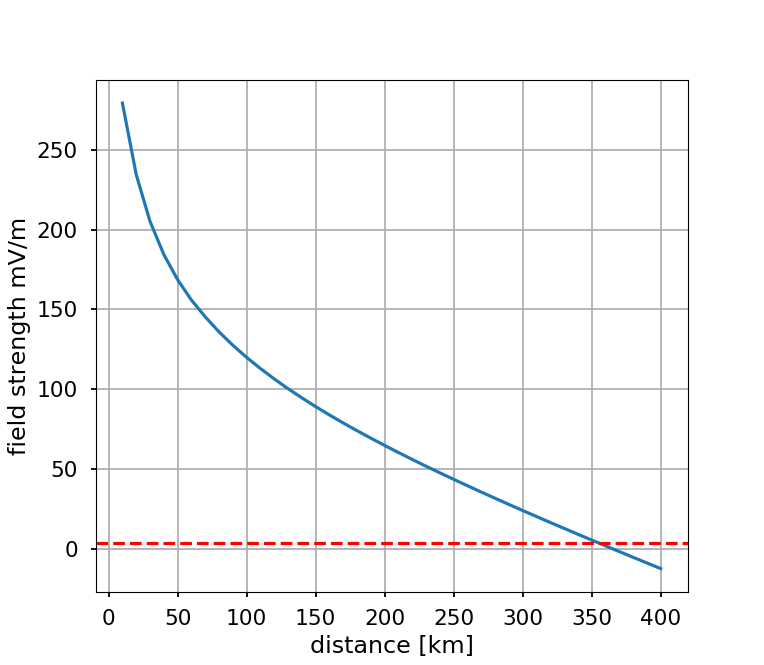

# GRWave groundwave propagation


Python for ITU P.368: Ground-wave propagation curves for frequencies between 10 kHz and 30 MHz.

[Original code](https://www.itu.int/en/ITU-R/study-groups/rsg3/Pages/iono-tropo-spheric.aspx)

More serious needs for LF propagation modeling should consider modern software like SPAWAR
[LWPC](https://www.ann-geophys.net/31/765/2013/angeo-31-765-2013.pdf)
since for communications circuits, signal strength is just one part of a complex system.
Other necessary dominant factors include:

* ITU-R [P.372](https://www.itu.int/rec/R-REC-P.372/en) Radio circuit noise
* ITU-R [F.1487](https://www.itu.int/rec/R-REC-F.1487-0-200005-I/en) Ionospheric circuit simultation. Even if you only want groundwave, the ionospheric path in general interferes with the groundwave path.



## Install

```sh
pip install -e .
```

## Usage

    python RunGRwave.py

This makes a very simple simulation plot, automatically feeding the
parameters into GRWAVE from Python. No files are used, just
`io.StringIO`.

## Ground conductivity

Serious use of this would involve incremental runs with conductivity.
To start assume uniform ground conductivity for the
[United States](https://www.fcc.gov/media/radio/m3-ground-conductivity-map)
or
[world atlas](http://hamwaves.com/ground/en/index.html).

### Variables

grwave.for is written in a way that's not easy to switch to taking
Python input directly. Instead we convert variables to StringIO in the
format grwave expects. Likewise, output is to StringIO and parsed.

ANS: [R] The refractivity of the troposphere at the surface of the earth in N-units. Default ANS= 315

HSCALE:[R] The scale height of the troposphere in kilometres. Default HSCALE = 7.35.

IPOLRN:[I] A code number for the polarization. Default IPOLRN = 1.
* 1 vertical polarization
* 2 horizontal polarization

FREQ: [R] The frequency in MHz. Default FREQ = 1.0.

EPSLON:[R] The relative permittivity of the surface of the earth.  Default EPSLON = 70.0 (sea).

SIGMA:[R] The conductivity of the surface of the earth in S/m. Default SIGMA = 5.0 (sea).

DMIN: [R] The minimum range in kilometres.  Default DMIN = 10.0.

DMAX: [R] The maximum range in kilometres.  Default DMAX = 200.0.

DSTEP:[R] The range step. See LOGLIN for further explanation.  Default DSTEP = 10.0.

LOGLIN:[I] If LOGLIN = 0 then DSTEP, the range step is added to the range in geometrical and extended flat earth calculation regions and subtracted in the residue series regions.
If LOGLIN = 1 then the new distance is computed by multiplying or dividing the previous distance by DSTEP. In this case, DSTEP is chosen to give a fixed number of points per logarithmic decade.
If N points per logarithmic decade are desired, DSTEP is equal to 10 to the power (1/N).
Default LOGLIN = 0.

[Note: In the residue series region, the calculations begin at DMAX
and proceed inward to the transition to the flat earth or
geometrical region. In these two regions, the calculations begin at
DMIN and proceed outward to the transition point. In the form
distributed, GRWAVE allows a maximum of 100 points in the residue
region and 100 points in the flat earth region. These limits may be
expanded by compiling the source code after modification of the
appropriate dimension statements.]

IG: [I] If IG = -1 or 0, the field is calculated at long distances using the residue series formulation. If IG = 0 or 1, the field is calculated at short distances using the geometric optics or extended flat earth formulation.
Default IG = 0.

JHT: [I] A variable which determines which combination of receiver antenna heights (HR(LR) LR=1,JR) and transmitter heights
(HT(LT) LT=1,JT) is used in computing the field. If JHT=1, all
possible combinations of pairs are used. If JHT=2, JR must equal JT
and the field is calculated for specific pairs of heights
[HR(1),HT(1)], [HR(2),HT(2)], .......[HR(JR),HT(JT)]. If
JHT=3, JR must equal JT. Then LR is varied from 1 to LR while LT is
varied from LR to LT. If the two arrays HR and HT are identical,
this excludes those combinations that can be found by reciprocity.
Default JHT = 1

HRR: [R] An array of of up to 20 receiver heights in metres.
The number of points, JR is determined by the program by counting
the number of heights entered. Default JR =1 ; HR(1)=100.0

HTT: [R] An array of of up to 20 transmitter heights in metres. The number of points, JT is determined by the program by counting the number of heights entered. Default JT =1 ; HT(1)=100.0

GO: A keyword used to indicate that the user has entered all variables and that the calculation of the field should proceed.


